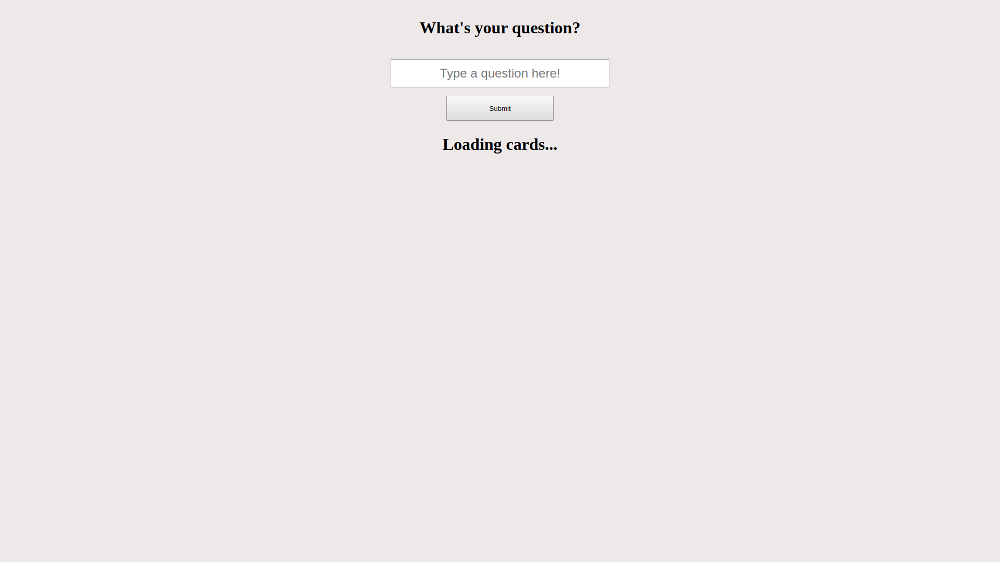

# React 

##### Create a react app that:
1. Takes a question from a form
2. Displays it as a card 
3. If there were no questions yet display `<h1>Loading cards...</h1>`


##### Use two components: 
- `<Cards />` which takes all the cards as a prop from your App.js
- `<Card />` which is called by Cards.js

## End Result 



## App.js 

```js
import React, { Component } from 'react';
import Card from './Card'
import Cards from './Cards'
import './App.css';

class App extends Component {

  render() {

    return (
      <section id="add-card" className="container">
        <div className="row">
          <h1>What's your question?</h1>
          <form name="add-card">
            <input
              type="text"
              className="question"
              name="question"
              placeholder="Type a question here!"
              value={this.state.question}
              onChange={(e) => this.handleChange(e)}
               />
            <input type="submit" className="btn-submit" value="Submit" onClick={(e) => this.handleSubmit(e)} />
          </form>
        </div>
        <Cards cards={this.state.cards} />        
      </section>
    )
  }
}

export default App;

```

## Card.js

```js
import React, { Component } from 'react'

export default class Card extends Component {
    render() {
        return (
            <div className="card">
                <h4 className={'card-title'}></h4>
            </div>
        )
    }
}
```

## Cards.js

```js
import React, { Component } from 'react'
import Card from './Card.js'

export default class Cards extends Component {
    render() {

        return (
            <div className="row">
                {allCards}
            </div>
        )
    }
}
```


## index.css

```css
body {
background: #EEE9E9;
}

.container {
  display: flex;
  flex-wrap: wrap;
  flex-direction: column;
  align-items: center;
  text-align: center;
}

h1 {
font-size: xx-large;
}

.question {
margin: 1rem 0;
height: 3rem;
width: 80%;
text-align: center;
font-size: x-large;
}

.btn-submit {
height: 3rem;
padding: 0 5rem;
}

.row {
  margin: 0;
}

.card {
  width: 35rem;
  height: auto;
  background: #231e1e;
  border-color: black;
  color: white;
  text-align: center;
  margin-top: 1rem;
  margin-bottom: 1rem;
  /* text-overflow: ellipsis;  */
  overflow: auto;
  white-space: wrap;
  box-shadow: 0 4px 8px 0 rgba(0, 0, 0, 0.2), 0 6px 20px 0 rgba(0, 0, 0, 0.19);
}

.card h4 {
  font-size: 2rem;
  /* make text wrap when it overflows */
  overflow-wrap: break-word;
  margin: 1rem;
}

.card h6 {
  font-size: 1.2rem;
  margin-top: 1.618rem;
  opacity: 0.2;
}

.card h6:after {
  font-size: 60%;
  margin-left: 1px;
}

.card:hover {
  cursor: pointer;
}

```